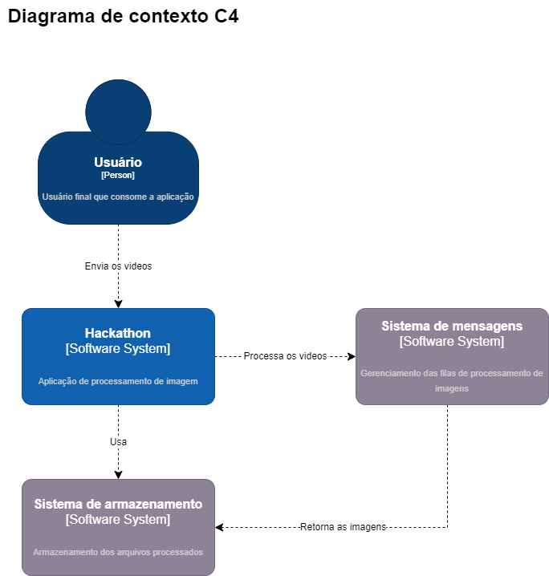
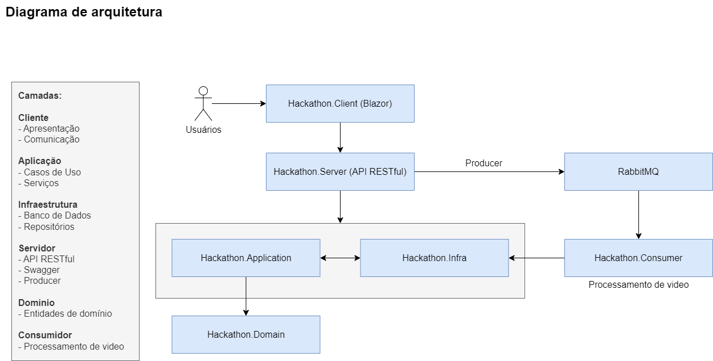
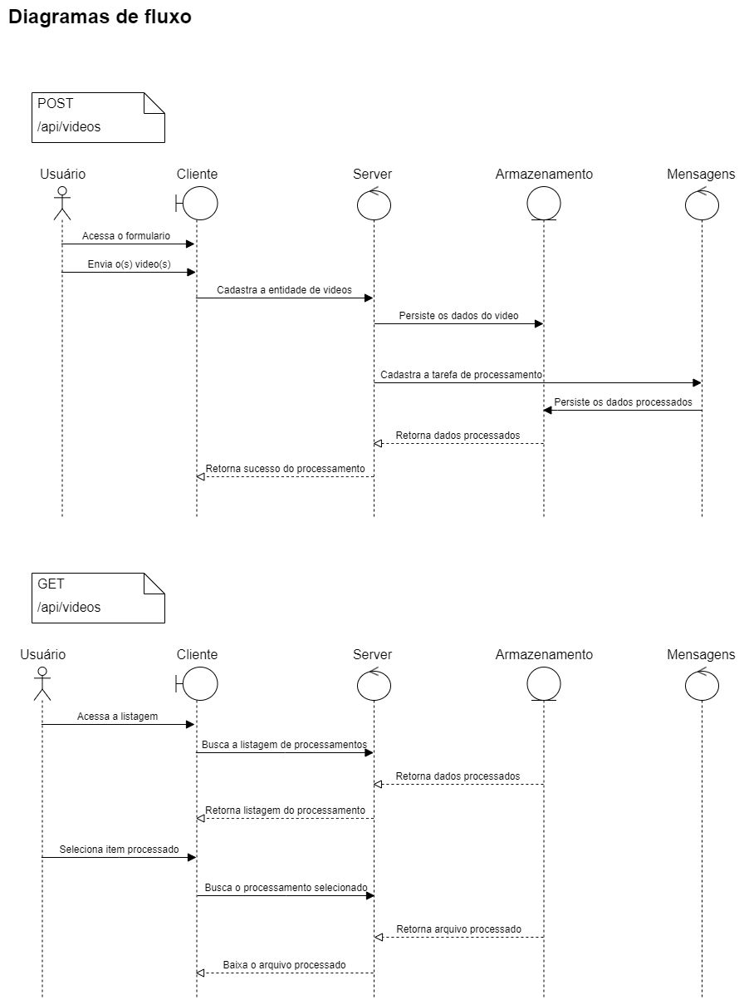

# Hackathon - Aplicação Blazor WebAssembly Core Hosted

## Projeto da Fase 5 - FIAP - Hackathon

## Visão Geral do Projeto Hackathon

O projeto Hackathon é uma aplicação desenvolvida para processar vídeos em imagens, utilizando tecnologia Blazor WebAssembly Core Hosted na versão 7 do .NET. Esta arquitetura combina os recursos do Blazor WebAssembly com uma abordagem baseada em Domain-Driven Design (DDD) e Clean Architecture, visando modularidade, escalabilidade e manutenibilidade do código.

### Estrutura do Projeto

O projeto Hackathon é dividido em diferentes camadas, cada uma com responsabilidades específicas:

1. **Hackathon.Client:**
   - A camada de apresentação, responsável pela interface do usuário no navegador.
   - Desenvolvida em Blazor WebAssembly, esta camada oferece uma experiência interativa e responsiva para os usuários.
   - Contém páginas, componentes e estilos que compõem a interface de usuário da aplicação.

2. **Hackathon.Application:**
   - Esta camada atua como intermediária entre a interface de usuário e o domínio.
   - Contém serviços de aplicação que coordenam as ações do usuário e orquestram a interação com o domínio.
   - Responsável por implementar casos de uso da aplicação, transformando solicitações da interface de usuário em operações no domínio.

3. **Hackathon.Infra:**
   - Camada de infraestrutura, responsável por gerenciar aspectos técnicos, como acesso a banco de dados, repositórios e serviços externos.
   - Utiliza o Entity Framework Core para interagir com o banco de dados PostgreSQL, fornecendo operações de persistência de dados para a aplicação.

4. **Hackathon.Server:**
   - Esta camada contém a API RESTful da aplicação.
   - Aqui estão os controladores responsáveis por receber e responder às solicitações HTTP dos clientes.
   - Comunica-se com a camada de aplicação que fornece os dados necessários para a camada de apresentação.

5. **Hackathon.Domain:**
   - Camada de domínio, onde a lógica de negócios reside.
   - Inclui entidades, serviços de domínio e objetos de valor.
   - Define o modelo de domínio da aplicação e encapsula as regras de negócio que regem o comportamento do sistema.

### Integração com RabbitMQ

Para facilitar o processamento de vídeos de forma assíncrona e distribuída, o projeto Hackathon utiliza o RabbitMQ como serviço de mensageria. A integração com o RabbitMQ é realizada da seguinte maneira:

- **Hackathon.Server (Producer):** Responsável por enviar eventos de processamento de vídeos para a fila do RabbitMQ. Após receber uma solicitação de processamento de vídeo, ele publica uma mensagem na fila do RabbitMQ para ser processada pelo consumidor.

- **Hackathon.Consumer (Consumer):** Novo projeto adicionado ao sistema, responsável por consumir as mensagens da fila do RabbitMQ e realizar o processamento dos vídeos. Após o processamento, ele pode publicar o resultado em um outro canal ou enviar uma notificação de conclusão.

Esta integração com o RabbitMQ permite que o processamento de vídeos seja escalável e tolerante a falhas, uma vez que as mensagens podem ser enfileiradas e processadas de forma assíncrona, sem bloquear a interface do usuário ou o servidor da aplicação.

### Benefícios da Arquitetura Utilizada

- **Separação de Responsabilidades:** A divisão em camadas permite isolar e gerenciar diferentes aspectos da aplicação de forma independente, facilitando a manutenção e evolução do código.
- **Flexibilidade e Escalabilidade:** A arquitetura baseada em DDD e Clean Architecture permite que a aplicação seja facilmente estendida e adaptada a novos requisitos de negócio, sem comprometer a integridade da base de código existente.
- **Testabilidade:** A separação clara entre as camadas facilita a escrita de testes automatizados em diferentes níveis da aplicação, garantindo a qualidade e robustez do software.

### Diagramas de fluxos

### Conclusão

O projeto Hackathon é uma aplicação desenvolvida para processar vídeos em imagens, utilizando Blazor WebAssembly, .NET Core e seguindo os princípios de Domain-Driven Design (DDD) e Clean Architecture. Com uma arquitetura bem estruturada e uma interface de usuário interativa, o projeto oferece uma solução completa e escalável para o processamento de vídeos. Estamos confiantes de que o projeto atenderá às expectativas dos usuários e oferecerá uma base sólida para futuras iterações e melhorias.

> Implementado por: [Daniela Miranda de Almeida](https://github.com/danimiran), [Jhean Ricardo Ramos](https://github.com/jheanr), [Lucas dos anjos Varela](https://github.com/LucasVarela42), [Marcelo de Moraes Andrade](https://github.com/MM-Andrade) e [Wellington Chida de Oliveira](https://github.com/WellingtonChidaOliveira).